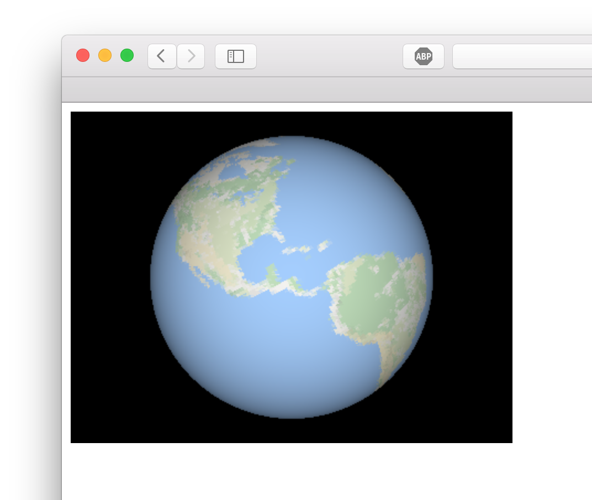

# earthpic

How would you represent a 3D image of a sphere? That is the question I'd like to answer with this project. This project is an attempt to capture a 3D snapshot of the Earth's surface using Google Maps, then to render said snapshot in 3D. It should not be *that* difficult, but I certainly never thought about this before.

# Screenshot

The current web application allows you to pan around a 3D rendering of the Earth. It looks like this:

